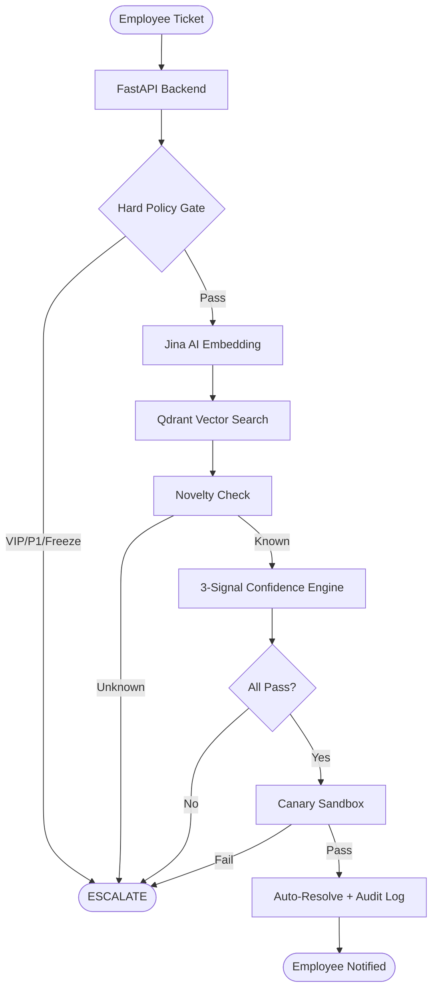

# 👁️ Argus

> **Intelligent Auto-Handling of Support Tickets with Confidence-Based Human-in-the-Loop (HITL)**


*Enterprises don't need AI that guesses. They need AI that **proves** when it is safe to act.*

---

## 📖 Table of Contents

1. [Problem Statement](#-problem-statement)
2. [The Solution](#-the-solution)
3. [Core Innovation: The 3-Signal Engine](#-core-innovation-the-3-signal-engine)
4. [System Architecture](#-system-architecture)
5. [Tech Stack](#-tech-stack)
6. [Project Structure](#-project-structure)
7. [Getting Started](#-getting-started)
8. [Demo Flow](#-demo-flow)
9. [Future Scope](#-future-scope)

---

## 🚨 Problem Statement

Large enterprises process thousands of IT support tickets daily. The current reality:
- Every ticket is manually triaged by human agents.
- Repetitive issues (password resets, account unlocks) consume expensive engineering time.
- Fully automated systems are too risky for enterprise governance.
- Rule-based automation breaks when faced with natural language variation.

**The Result:** Slow resolution times, SLA breaches, high costs, and zero institutional memory.

---

## 💡 The Solution

Argus is a two-portal web application that acts as an intelligent intermediary for IT support tickets. It operates on a strict principle:

1. **Auto-resolves** only the tickets it can mathematically *prove* are safe to fix.
2. **Escalates** everything else to human agents with a pre-built intelligence brief (Evidence Card).
3. **Learns** from every human decision to safely expand its automation boundaries over time.

### Two User Portals

* **Employee Portal:** A simple interface to raise tickets (text/image) and track real-time resolution status.
* **Agent Portal:** A command center for reviewing escalated tickets, analyzing AI reasoning, approving fixes, and monitoring system health.

---

## 🧠 Core Innovation: The 3-Signal Engine

Argus never auto-resolves based on a single AI confidence score. It requires **three independent mathematical signals** to pass, followed by a **live sandbox test**:

1. **Signal A (Semantic Similarity):** Does this ticket match a known, safely resolved historical ticket? *(Powered by Jina AI embeddings + Qdrant Vector Search)*
2. **Signal B (Resolution Consistency):** Historically, did similar tickets all get fixed the same way? Or did they require different approaches?
3. **Signal C (Category Accuracy):** Is this category of tickets reliably safe to automate based on the last 30 days of data? *(Cold-start protection built-in)*

If **ALL** signals pass, the fix is deployed to a **Canary Sandbox**. Only if the sandbox returns a success code is the fix applied to production. If **ANY** step fails, the ticket is instantly escalated.

---

## 🏗 System Architecture



### Layer Breakdown
1. **Layer 0 - Hard Policy Gate:** Deterministic checks (Severity, VIP user, Change Freezes). No AI override possible.
2. **Layer 1 - Embedding & Retrieval:** `jina-embeddings-v3` converts text to vectors. Gemma 3 extracts text from images. Searched against Qdrant.
3. **Layer 2 - Novelty Detection:** Rejects tickets completely outside the system's known domain.
4. **Layer 3 - Confidence Engine:** The 3-Signal test (Similarity, Consistency, Accuracy).
5. **Layer 4 - Canary Sandbox:** Isolated mock IT environment to test fixes before production.
6. **Layer 5 - HITL Escalation:** Generates an **Evidence Card** using Gemma 3 27B explaining exactly *why* automation was blocked, presenting candidate fixes to the human agent.

---

## 🛠 Tech Stack

| Component | Technology | Purpose |
| :--- | :--- | :--- |
| **Frontend** | React, Vite, shadcn/ui, Tailwind | Employee & Agent Portals |
| **Backend** | Python, FastAPI | High-performance async API |
| **Database** | Supabase (PostgreSQL) | Users, Tickets, Audit Logs, History |
| **Vector DB** | Qdrant Cloud | RAG Knowledge Base |
| **Embeddings** | Jina AI API | Text-to-vector conversion |
| **LLM / Vision** | Gemma 3 27B (via OpenRouter)| Evidence Cards, OCR, Message Refinement |
| **Testing** | Pytest | Unit and Integration testing |

---

## 📂 Project Structure

```text
argus/
├── backend/               # FastAPI application (Port 8000)
│   ├── api/               # REST endpoints
│   ├── core/              # Pipeline logic (Confidence Engine, Policy Gate)
│   ├── services/          # External API clients (Supabase, Qdrant, Jina)
│   ├── models/            # Pydantic data schemas
│   └── utils/             # Audit hashing, clustering
├── sandbox/               # Isolated Canary Server (Port 8001)
├── frontend/              # React Application (Port 5173)
├── scripts/               # Data seeding and generation tools
├── database/              # SQL Schemas
└── tests/                 # Comprehensive test suite
```

---

## 🚀 Getting Started

### Prerequisites
- Python 3.11+
- Node.js 18+
- Accounts/API Keys for: Supabase, Qdrant Cloud, Jina AI, OpenRouter.

### 1. Environment Setup

Create a `.env` file in the `backend/` directory:

```env
SUPABASE_URL=your_supabase_url
SUPABASE_ANON_KEY=your_supabase_key
SUPABASE_SERVICE_ROLE_KEY=your_service_role_key

QDRANT_URL=your_qdrant_url
QDRANT_API_KEY=your_qdrant_key
QDRANT_COLLECTION=resolved_tickets

JINA_API_KEY=your_jina_key

OPENROUTER_API_KEY=your_openrouter_key
OPENROUTER_MODEL=google/gemma-3-27b-it:free

SANDBOX_URL=http://localhost:8001
```

### 2. Backend & Sandbox

```bash
cd backend
pip install -r requirements.txt
uvicorn api.main:app --host 0.0.0.0 --port 8000 --reload

# In a new terminal, start the sandbox
cd sandbox
pip install -r requirements.txt
uvicorn main:app --host 0.0.0.0 --port 8001 --reload
```

### 3. Frontend

```bash
cd frontend
npm install
npm run dev
```

### 4. Database Seeding

Run the setup scripts to populate mock users, thresholds, and the demo dataset:
```bash
python scripts/seed_systems.py
python scripts/seed_thresholds.py
python scripts/prepare_demo.py
```

---

## 🎬 Demo Flow

Argus is designed to be demonstrated through 5 specific ticket scenarios that showcase the entire pipeline:

1. **The Perfect Match:** Standard password reset. High similarity, high consistency. Instantly auto-resolves.
2. **Cross-Category Success:** SAP login failure. Proves the system handles multiple domains. Auto-resolves.
3. **The Inconsistent Fix:** Network issue. History shows this was fixed in 3 different ways previously. *Signal B fails.* System safely escalates to a human.
4. **The Policy Override:** Email issue submitted by the CEO. *Hard Policy Gate triggers instantly.* Escalated with zero AI involvement.
5. **The Critical Incident:** P1 severity database outage. Instantly escalated based on business rules.

**The "Wow" Moment:** After a human resolves ticket #3 and marks it as a "Verified Fix," submit the exact same ticket again. The system will have learned from the human action and will auto-resolve it the second time.

---

## 🔒 Security & Compliance

- **Cryptographic Audit Trail:** Every decision (auto or human) generates a SHA-256 Merkle chain hash logged in Supabase.
- **Fail-Safe Design:** If any external service (Qdrant, Jina, Sandbox) goes down, the system immediately defaults to manual escalation.
- **Verification Gate:** Only resolutions explicitly marked by human agents as "Verified Reusable Fixes" enter the vector database. Workarounds are kept strictly in relational storage.

---

## 🔮 Future Scope

- **Audio/Video Tickets:** Integration with Gemini 2.5 Flash Lite for transcription of multimodal support requests.
- **ServiceNow/Jira Integration:** Two-way sync with enterprise ITSM platforms.
- **Active Directory Sandbox:** Connecting the canary layer to real LDAP test servers.
- **Self-Healing Accuracy:** Automated detection of vector drift using Isolation Forests.

---
*Built with precision. Architected for trust.*
