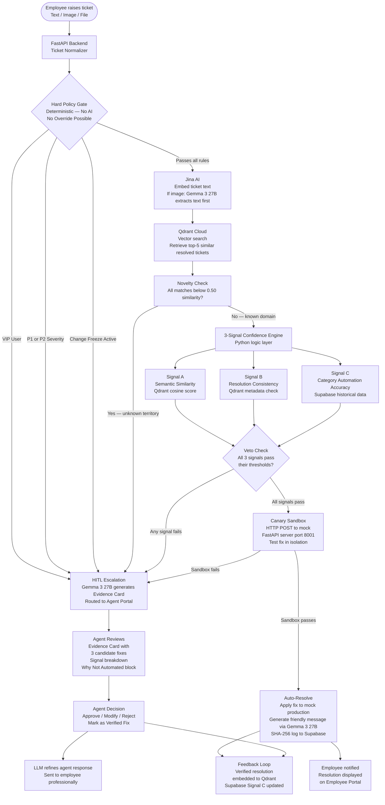
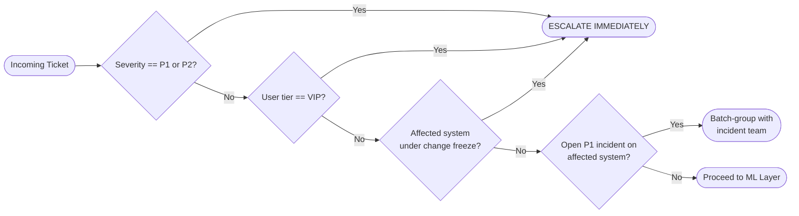
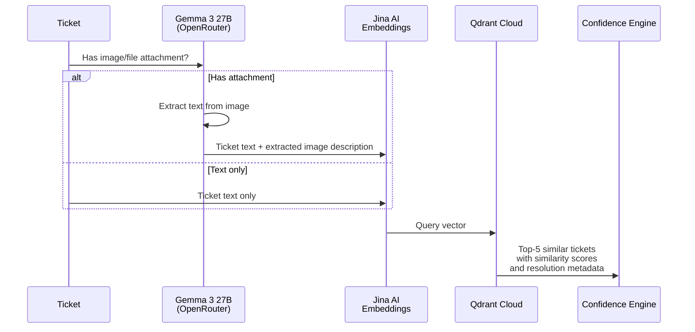
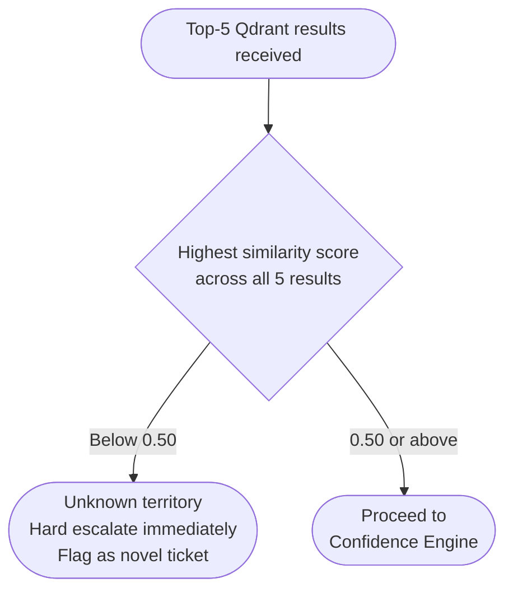
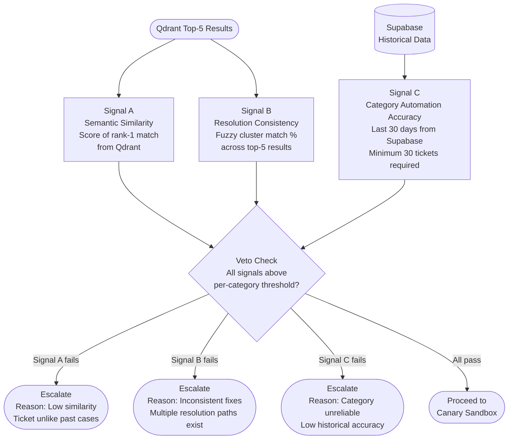
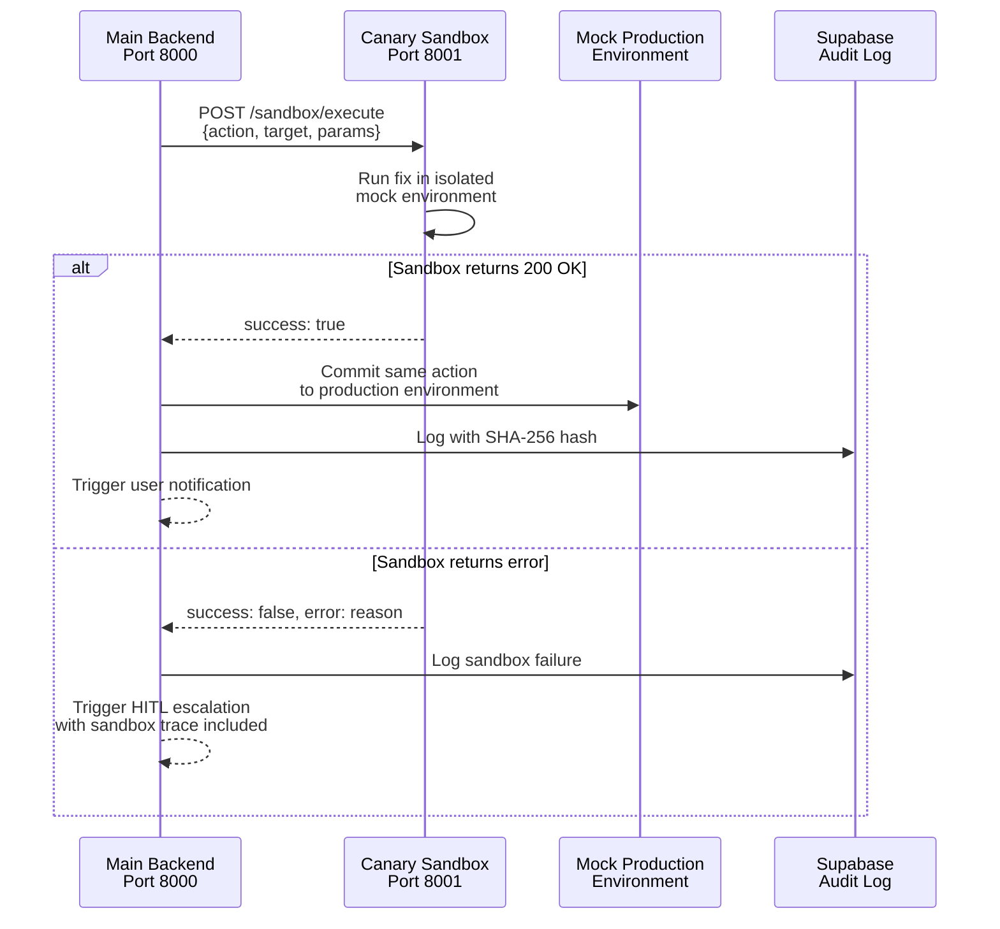
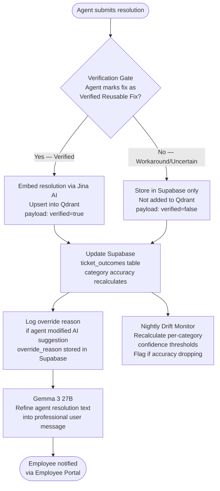
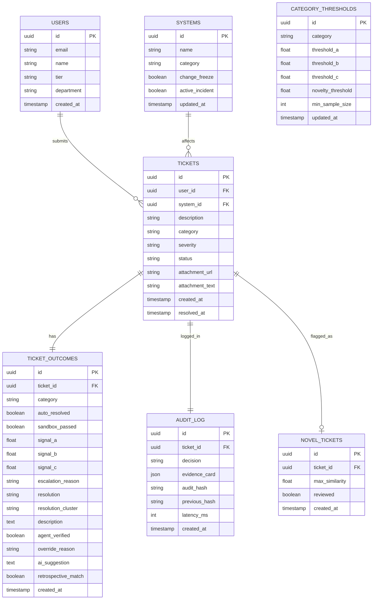
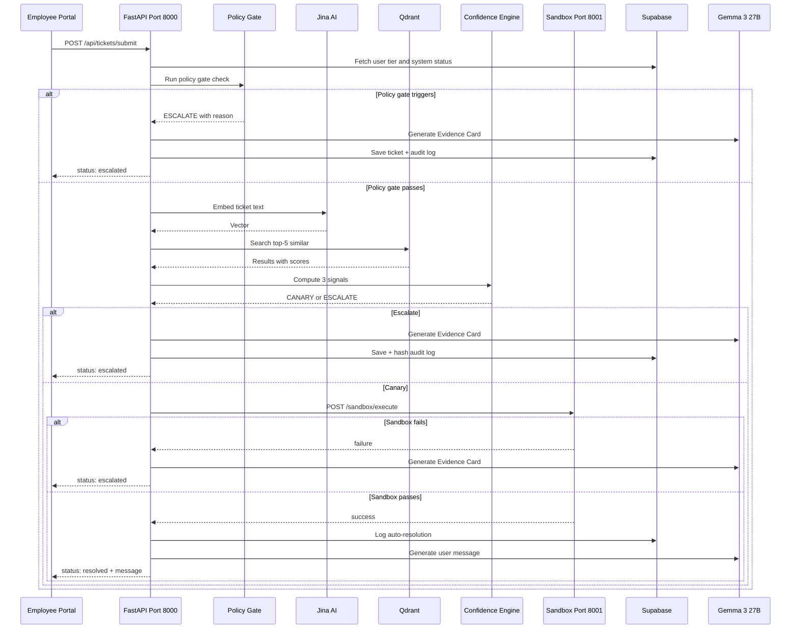

# Argus — Complete Solution Document
### Intelligent Auto-Handling of Support Tickets with Confidence-Based Human-in-the-Loop (HITL)

---

> **Core Philosophy:** Enterprises don't need AI that guesses. They need AI that **proves** when it is safe to act.

---

## Table of Contents

1. [Problem Statement](#1-problem-statement)
2. [Solution Overview](#2-solution-overview)
3. [System Architecture](#3-system-architecture)
4. [Layer-by-Layer Breakdown](#4-layer-by-layer-breakdown)
5. [Data Strategy](#5-data-strategy)
6. [Tech Stack](#6-tech-stack)
7. [Database Design](#7-database-design)
8. [API Design](#8-api-design)
9. [Frontend Design](#9-frontend-design)
10. [Security and Audit](#10-security-and-audit)
11. [Operational Metrics](#11-operational-metrics)
12. [Edge Cases and Safeguards](#12-edge-cases-and-safeguards)
13. [Future Scope](#13-future-scope)
14. [Demo Script](#14-demo-script)
15. [Build Checklist](#15-build-checklist)

---

## 1. Problem Statement

Large enterprises receive thousands of IT and application support tickets daily. The current state:

- Every ticket is manually read and triaged by a human agent
- Repetitive tickets (password resets, account unlocks, VPN issues) consume senior engineer time
- SLA breaches occur due to slow manual routing
- No institutional memory — the same ticket is solved from scratch repeatedly
- Fully automated systems are too risky for enterprise governance
- Rule-based automation lacks adaptability to natural language variation

**The result:** Slow resolution times, high operational costs, SLA penalties, and skilled engineers wasting time on solved problems.

---

## 2. Solution Overview

Argus is a two-portal web application that intelligently handles IT support tickets by:

1. **Auto-resolving** tickets it can mathematically prove are safe to fix
2. **Escalating** everything else to human agents with a pre-built intelligence brief
3. **Learning** from every human decision to improve over time

The system never auto-resolves a ticket based on a single confidence score or LLM output. It requires **three independent signals** to all pass, plus a **live sandbox test**, before any automated action is committed.

### Two User Portals

**Employee Portal**
- Employee raises a ticket (text + optional file/image attachment)
- Sees real-time status: processing, auto-resolved, or under human review
- Receives a friendly resolution message (LLM-generated) when resolved

**Agent Portal**
- Sees all escalated tickets with full Evidence Cards
- Reviews AI reasoning, candidate fixes, signal breakdown
- Approves, modifies, or rejects suggested resolutions
- Marks fixes as verified (controls what enters the knowledge base)
- Monitors system health and operational metrics

---

## 3. System Architecture

### High-Level Architecture



---

## 4. Layer-by-Layer Breakdown

### Layer 0: Hard Policy Gate

This layer runs **before any AI or ML component**. It checks deterministic facts from the ticket metadata and Supabase user/system records. There is no probability, no threshold tuning, and no override mechanism.



**Implementation notes for AI coder:**
- Query Supabase `users` table for `user_tier` field on ticket submission
- Query Supabase `systems` table for `change_freeze` boolean and `active_incident` boolean
- Severity is **AI-classified** by Gemma 3 27B from the ticket description — employee does NOT select severity
- Employee form only collects: work email, system ID, category (optional), is_urgent toggle, description, attachment
- This entire layer is a simple Python function with if/else conditions — no ML libraries

```python
def classify_severity(description: str, gemma_client) -> str:
    """AI classifies severity — employee never selects this"""
    prompt = f"""Classify this IT ticket severity. Reply with ONLY one of: P1, P2, P3, P4.
P1 = entire company/team affected, production down
P2 = multiple users affected, significant business impact  
P3 = single user, moderate impact
P4 = single user, low impact, cosmetic

Ticket: {description}"""
    return gemma_client.classify(prompt)  # returns "P1"/"P2"/"P3"/"P4"

def hard_policy_gate(ticket: Ticket, user: User, system: System) -> GateResult:
    if ticket.severity in ["P1", "P2"]:
        return GateResult(action="ESCALATE", reason="Critical severity")
    if user.tier == "vip":
        return GateResult(action="ESCALATE", reason="VIP user — human review required")
    if system.change_freeze:
        return GateResult(action="ESCALATE", reason="System under change freeze")
    if system.active_incident:
        return GateResult(action="BATCH_ESCALATE", reason="Active P1 incident on system")
    return GateResult(action="PROCEED", reason="Passed all policy checks")
```

---

### Layer 1: Embedding and Retrieval

Once a ticket passes the policy gate, it is converted into a vector embedding and used to search the historical knowledge base in Qdrant.

**If the ticket contains an image or file attachment:**
- Gemma 3 27B (via OpenRouter) processes the image first
- Extracts a text description of the visual content
- That extracted text is appended to the ticket description
- Combined text is then embedded via Jina AI

**If text only:**
- Ticket description goes directly to Jina AI for embedding



**Implementation notes for AI coder:**
- Use `jina-embeddings-v3` model via Jina AI API (free tier: 1M tokens/month)
- Qdrant collection name: `resolved_tickets`
- Each Qdrant point payload structure:
```json
{
  "ticket_id": "INC-10001",
  "description": "password expired cannot login to laptop",
  "category": "Auth/SSO",
  "severity": "P3",
  "resolution": "Reset user password via LDAP / Active Directory",
  "resolution_cluster": "password_reset",
  "user_tier": "standard",
  "department": "Finance",
  "verified": true
}
```
- Qdrant query: retrieve top-5 with `with_payload=True` to access resolution metadata
- Filter Qdrant query by `verified=true` to only retrieve quality-checked resolutions

---

### Layer 2: Novelty Detection

Before computing confidence signals, check if the ticket is genuinely within the system's known domain.



**Implementation notes for AI coder:**
- `max_similarity = max([r.score for r in qdrant_results])`
- If `max_similarity < 0.50`: return escalation with reason `"Novel ticket — no similar historical cases found"`
- Log novel tickets separately in Supabase `novel_tickets` table for future knowledge base expansion
- This threshold (0.50) is configurable in environment variables

---

### Layer 3: 3-Signal Confidence Engine

The core decision layer. Three independent signals are computed. **All three must pass their per-category calibrated thresholds.** Any single failure forces escalation regardless of the other two signals.



**Signal A — Semantic Similarity**
- Value: cosine similarity score of the top-1 Qdrant result
- Default threshold: 0.85 (per-category, configurable)
- What it checks: is this ticket genuinely close to a known resolved ticket?

**Signal B — Resolution Consistency**
- Value: percentage of top-5 results belonging to the same resolution cluster
- Resolution clustering: at system startup, cluster all resolution tags using sentence-transformers and agglomerative clustering. "server_restart", "reboot", "restart_required" all map to one cluster ID
- Default threshold: 3 out of 5 results must share the same cluster (60%)
- What it checks: did similar past tickets all get fixed the same way?

**Signal C — Category Automation Accuracy**
- Value: percentage of successfully auto-resolved tickets in this category over last 30 days
- Source: Supabase `ticket_outcomes` table
- Default threshold: 70% success rate minimum
- Cold start rule: if fewer than 30 tickets exist for this category, Signal C automatically fails — system escalates until sufficient history exists
- What it checks: is this category of ticket reliably safe to automate?

**Implementation notes for AI coder:**
```python
def compute_confidence(
    qdrant_results: list,
    category: str,
    supabase_client
) -> ConfidenceReport:

    # Signal A
    s_a = qdrant_results[0].score

    # Signal B — fuzzy cluster consistency
    clusters = [get_resolution_cluster(r.payload["resolution"]) for r in qdrant_results]
    most_common = max(set(clusters), key=clusters.count)
    s_b = clusters.count(most_common) / len(clusters)

    # Signal C — from Supabase
    history = supabase_client.table("ticket_outcomes")\
        .select("*")\
        .eq("category", category)\
        .gte("created_at", thirty_days_ago())\
        .execute()

    if len(history.data) < 30:
        return ConfidenceReport(
            decision="ESCALATE",
            reason="Insufficient category history — cold start protection"
        )

    s_c = sum(1 for t in history.data if t["auto_resolved"]) / len(history.data)

    # Per-category thresholds from Supabase config table
    thresholds = get_category_thresholds(category)

    signals = {"similarity": s_a, "consistency": s_b, "accuracy": s_c}
    failures = {k: v for k, v in signals.items() if v < thresholds[k]}

    if failures:
        return ConfidenceReport(decision="ESCALATE", signals=signals, failed=failures)

    return ConfidenceReport(decision="CANARY", signals=signals, failed={})
```

---

### Layer 4: Canary Sandbox

Before committing any automated fix to the mock production environment, the system tests it in an isolated sandbox environment.

The sandbox is a **separate FastAPI application running on port 8001** with its own mock user accounts, services, and systems. The main backend sends a real HTTP POST request to this server. Only a successful response triggers the production commit.



**Sandbox server structure (port 8001):**
```python
# sandbox_server.py — runs independently
sandbox_env = {
    "users": {
        "john.doe": {"status": "locked", "password_status": "expired"},
        "jane.smith": {"status": "active", "password_status": "valid"}
    },
    "services": {
        "sap": {"status": "running"},
        "vpn": {"status": "stopped"},
        "email": {"status": "running"}
    }
}

@app.post("/sandbox/execute")
def execute_in_sandbox(action: str, target: str):
    if action == "unlock_account":
        if target in sandbox_env["users"]:
            sandbox_env["users"][target]["status"] = "active"
            return {"success": True, "message": f"Account {target} unlocked in sandbox"}
        return {"success": False, "error": "User not found"}

    if action == "restart_service":
        if target in sandbox_env["services"]:
            sandbox_env["services"][target]["status"] = "running"
            return {"success": True, "message": f"Service {target} restarted in sandbox"}
        return {"success": False, "error": "Service not found"}

    return {"success": False, "error": "Unknown action"}
```

---

### Layer 5: HITL Escalation and Evidence Card

When any layer fails, the ticket is escalated to the Agent Portal with a fully structured Evidence Card generated by Gemma 3 27B via OpenRouter.

**Evidence Card Structure:**

```json
{
  "ticket_id": "INC-20481",
  "submitted_by": "john.doe@company.com",
  "category": "Auth/SSO",
  "description": "Cannot login to SAP after returning from leave",
  "escalation_reason": "Signal B failed — inconsistent historical fixes",
  "signals": {
    "similarity": {"score": 0.88, "threshold": 0.85, "result": "PASS"},
    "consistency": {"score": 0.40, "threshold": 0.60, "result": "FAIL"},
    "accuracy": {"score": 0.82, "threshold": 0.70, "result": "PASS"}
  },
  "novelty_check": {"max_similarity": 0.88, "threshold": 0.50, "result": "PASS"},
  "why_not_automated": "3 similar tickets found but resolved differently: Ticket #184 used password reset, Ticket #211 used account unlock, Ticket #266 used SAP permission change. AI cannot safely determine the correct fix.",
  "candidate_fixes": [
    {"ticket_id": "INC-184", "similarity": 0.88, "resolution": "Reset SAP password via LDAP", "success_rate": "94%"},
    {"ticket_id": "INC-211", "similarity": 0.81, "resolution": "Unlock Active Directory account", "success_rate": "89%"},
    {"ticket_id": "INC-266", "similarity": 0.76, "resolution": "Reassign SAP role permissions", "success_rate": "71%"}
  ],
  "decision_latency": {
    "total_ms": 1420,
    "embedding_ms": 320,
    "vector_search_ms": 210,
    "signal_evaluation_ms": 30,
    "evidence_card_generation_ms": 860
  },
  "audit_hash": "sha256:a3f8c1d2e9b7f4a1c8d3e2b9f7a4c1d8",
  "previous_hash": "sha256:b7c2d9e4f1a8b3c6d1e9f2a7b4c8d3e1",
  "timestamp": "2026-02-23T09:14:33Z"
}
```

---

### Layer 6: Agent Decision and Feedback Loop

After agent resolves a ticket, the system captures the decision and learns from it.



**Override logging — agent UI fields:**
```
Resolution text: [textarea]
Resolution type:
  ( ) Verified reusable fix     ← enters Qdrant
  ( ) Temporary workaround      ← Supabase only
  ( ) Uncertain                 ← Supabase only

If modifying AI suggestion, reason:
  ( ) Incorrect suggestion
  ( ) Missing context
  ( ) Multiple possible fixes
  ( ) User clarification required
  ( ) Other
```

---

## 5. Data Strategy

### The Two Databases and What Goes in Each

The same CSV seed file populates both databases. Different columns go to each:

| Column | Qdrant | Supabase (ticket_outcomes) | Purpose |
|---|---|---|---|
| `ticket_id` | ✅ point ID | ✅ | Reference key |
| `description` | ✅ **embedded as vector** | ✅ | Qdrant: similarity search. Supabase: display in agent dashboard |
| `category` | ✅ payload | ✅ | Qdrant: filter. Supabase: Signal C grouping |
| `severity` | ✅ payload | ❌ | Context only |
| `resolution` | ✅ payload | ✅ | Qdrant: candidate fix. Supabase: reference |
| `resolution_cluster` | ✅ payload | ✅ | Signal B cluster matching |
| `user_tier` | ✅ payload | ❌ | Context only |
| `department` | ❌ | ❌ | Not needed in either |
| `auto_resolved` | ❌ | ✅ | **Signal C reads this** |
| `verified` | ✅ payload filter | ❌ | Qdrant only retrieves verified=true |
| `created_at` | ❌ | ✅ | Signal C 30-day lookback |

### Synthetic Dataset Generation

500 seed tickets generated with correct distribution representing **shadow mode historical data**:

```
82% auto_resolved = true  → AI agreed with human resolution during shadow mode
18% auto_resolved = false → VIP/P1/P2 tickets + ambiguous Signal B tickets
```

**Distribution:**
- ~410 high-confidence routine tickets (auto_resolved=true) across 8 categories
- ~40 ambiguous tickets where resolution history was inconsistent (auto_resolved=false)
- ~50 VIP/P1/P2 tickets (auto_resolved=false — hard rule escalations)

**Why 82% matters:** Signal C threshold is 0.70. With 82% auto_resolved=true in seed data, all 8 categories immediately pass Signal C from day one. No cold-start problem at demo time.

### Shadow Mode Justification (For Judges)

> "These 500 rows represent a shadow mode observation period before going live. The AI ran silently alongside human agents. When the AI's suggested resolution matched what the agent did, that ticket was recorded as auto_resolved=true. This is how Signal C is bootstrapped in real enterprise deployments — not from manual configuration, but from proven accuracy."

### Real Enterprise Deployment Bootstrap

```
Month 1-2: Shadow Mode
→ All tickets go to human agents
→ AI runs silently, generates suggestion
→ Agent resolves ticket
→ System compares: AI suggestion ≈ agent resolution?
  YES → ticket_outcomes: auto_resolved=true (retrospective_match=true)
  NO  → ticket_outcomes: auto_resolved=false (retrospective_match=false)
→ Signal C builds up from real agreement rate

Month 3+: Live Mode
→ Categories crossing 70% → auto-resolution activates
→ Both tables updated by every pipeline ticket
→ System improves continuously
```

### Retrospective Validation (Anti-Deadlock)

To prevent Signal C from getting stuck in a low-confidence loop, every escalated ticket still generates a silent AI suggestion. After agent resolves it, the system compares:

```python
if fuzzy_match(ai_suggestion, agent_resolution) > 0.85:
    ticket_outcomes.auto_resolved = True
    ticket_outcomes.retrospective_match = True
else:
    ticket_outcomes.retrospective_match = False
```

This means even failed Signal C tickets contribute to improving Signal C over time.

### Data Loading Pipeline

```
argus_seed_data_final.csv (500 rows)
        ↓
Python loading script (run once)
    ├── Embed each description via Jina AI
    │       ↓
    │   Upsert into Qdrant Cloud
    │   (vector + payload: description, category, severity,
    │    resolution, resolution_cluster, user_tier, verified)
    │
    └── Insert into Supabase ticket_outcomes
        (ticket_id, description, category, resolution,
         resolution_cluster, auto_resolved, verified, created_at)
        signal_a/b/c = NULL for seed data (filled by live pipeline)
        ai_suggestion = NULL (shadow mode pre-dates this feature)
        retrospective_match = NULL (shadow mode pre-dates this feature)
```

---

## 6. Tech Stack

| Layer | Technology | Purpose | Cost |
|---|---|---|---|
| **LLM** | Gemma 3 27B via OpenRouter | Evidence Card generation, text + vision understanding, response refinement | Free tier |
| **Embeddings** | Jina AI (jina-embeddings-v3) | Convert ticket text to vectors | Free tier (1M tokens/month) |
| **Vector DB** | Qdrant Cloud | Store and search resolved ticket embeddings | Free tier (1GB) |
| **Relational DB** | Supabase (PostgreSQL) | Tickets, users, audit log, Signal C history, system config | Free tier |
| **Backend** | FastAPI (Python) | Main API server, confidence engine, orchestration | Free (self-hosted) |
| **Sandbox** | FastAPI (Python, port 8001) | Isolated mock IT environment for canary testing | Free (self-hosted) |
| **Frontend** | React + shadcn/ui | Employee and Agent portals | Free |
| **RAG Orchestration** | LangChain + raw Qdrant Python SDK | Retrieval chain, document loading | Free |
| **File Storage** | Supabase Storage | Store uploaded images and files | Free tier |
| **Vision** | Gemma 3 27B (same model) | Extract text from image attachments | Free tier via OpenRouter |
| **Data Generation** | Claude / GPT / Gemini | One-time synthetic dataset generation | Manual, one-time |
| **Future: Audio/Video** | Gemini 2.5 Flash Lite | Transcribe audio/video tickets | Google AI Studio free tier |

**Total runtime cost: $0**

---

## 7. Database Design

### Supabase Tables



---

## 8. API Design

### Main Backend (Port 8000)

| Method | Endpoint | Description |
|---|---|---|
| POST | `/api/tickets/submit` | Employee submits new ticket |
| GET | `/api/tickets/{ticket_id}` | Get ticket status and resolution |
| GET | `/api/tickets/agent/escalated` | Get all escalated tickets for agent |
| POST | `/api/tickets/{ticket_id}/resolve` | Agent submits resolution |
| GET | `/api/audit/{ticket_id}` | Get audit log with hash chain |
| GET | `/api/metrics/dashboard` | Get operational metrics |
| GET | `/api/metrics/coverage` | Get knowledge base coverage stats |
| GET | `/api/metrics/drift` | Get confidence trend data |
| GET | `/api/config/thresholds` | Get current category thresholds |

### Sandbox Server (Port 8001)

| Method | Endpoint | Description |
|---|---|---|
| POST | `/sandbox/execute` | Execute action in sandbox |
| GET | `/sandbox/status` | Get current sandbox environment state |
| POST | `/sandbox/reset` | Reset sandbox to initial state |
| GET | `/sandbox/logs` | Get sandbox execution logs |

### Ticket Submission Flow



---

## 9. Frontend Design

### Employee Portal Pages

**1. Submit Ticket Page**
- Work email (used to look up user_id and tier from Supabase)
- System ID (user pastes UUID — looked up from systems table)
- Category dropdown: optional, AI will auto-detect if left blank
- Mark as Urgent toggle: boolean, off by default. Does NOT affect AI classification — only bumps queue position
- Text area for ticket description
- File upload: images, documents (stored in Supabase Storage)
- Submit button
- **No severity dropdown** — AI classifies severity from description via Gemma 3 27B

**2. Ticket Status Page**
- Real-time status indicator: Processing / Auto-Resolved / Under Human Review
- If resolved: friendly LLM-generated resolution message
- If pending: "Your ticket is under review by our support team. You will be notified shortly."
- Decision latency shown after resolution

### Agent Portal Pages

**1. Escalated Tickets Queue**
- List of all pending escalated tickets
- Sorted by: severity, submission time
- Quick preview: category, escalation reason, time waiting

**2. Evidence Card View**

```
┌─────────────────────────────────────────────────┐
│ Ticket INC-20481 — Auth/SSO                     │
│ Submitted by: john.doe | Priority: P3           │
├─────────────────────────────────────────────────┤
│ CONFIDENCE SIGNALS                              │
│                                                 │
│ Signal A — Similarity                           │
│ Score: 0.88 | Threshold: 0.85 | ✅ PASS         │
│                                                 │
│ Signal B — Resolution Consistency               │
│ Score: 0.40 | Threshold: 0.60 | ❌ FAIL         │
│                                                 │
│ Signal C — Category Accuracy                    │
│ Score: 0.82 | Threshold: 0.70 | ✅ PASS         │
│                                                 │
│ Novelty Check: 0.88 > 0.50 ✅ PASS              │
├─────────────────────────────────────────────────┤
│ WHY NOT AUTOMATED                               │
│ Signal B failed — inconsistent historical fixes │
│ • Ticket #184 → Reset SAP password              │
│ • Ticket #211 → Unlock AD account               │
│ • Ticket #266 → Reassign SAP role               │
│ AI cannot determine the correct fix safely.     │
├─────────────────────────────────────────────────┤
│ CANDIDATE FIXES                                 │
│ 1. Reset SAP password via LDAP (sim: 0.88)      │
│ 2. Unlock Active Directory account (sim: 0.81)  │
│ 3. Reassign SAP role permissions (sim: 0.76)    │
├─────────────────────────────────────────────────┤
│ Decision latency: 1.42 seconds                  │
│ Embedding: 320ms | Search: 210ms                │
│ Signals: 30ms | Card gen: 860ms                 │
├─────────────────────────────────────────────────┤
│ YOUR RESOLUTION                                 │
│ [Text area for agent to type resolution]        │
│                                                 │
│ Resolution type:                                │
│ (●) Verified reusable fix                       │
│ ( ) Temporary workaround                        │
│ ( ) Uncertain                                   │
│                                                 │
│ [Submit Resolution]                             │
└─────────────────────────────────────────────────┘
```

**3. What-If Simulator**
- Interactive panel: change user tier, severity, system status
- Instantly re-runs decision pipeline
- Shows which layer intercepted and why
- Demonstrates AI is subordinate to business rules

**4. Operational Metrics Dashboard**

```
┌─────────────────────────────────────────────────────┐
│ SYSTEM PERFORMANCE — Last 100 Tickets               │
│                                                     │
│ ✅ Auto-resolved safely:     62                     │
│ 👨‍💻 Escalated to human:      38                      │
│ ⚠️  Failed sandbox checks:    2                     │
├─────────────────────────────────────────────────────┤
│ KNOWLEDGE BASE COVERAGE                             │
│ Tickets in Qdrant: 512                              │
│ Categories covered: 8                               │
│ Average similarity of new tickets: 0.84             │
│ Coverage level: Moderate                            │
├─────────────────────────────────────────────────────┤
│ SYSTEM HEALTH (Drift Monitor)                       │
│ Signal A trend (7 days): ↑ Stable ✅                │
│ Signal B trend (7 days): → Stable ✅                │
│ Signal C trend (7 days): ↓ Slight drop ⚠️           │
├─────────────────────────────────────────────────────┤
│ OVERRIDE ANALYSIS                                   │
│ Incorrect suggestion: 12                            │
│ Missing context: 8                                  │
│ Multiple possible fixes: 14                         │
│ User clarification required: 4                      │
└─────────────────────────────────────────────────────┘
```

---

## 10. Security and Audit

### SHA-256 Merkle Chain

Every ticket decision is logged with a cryptographic hash that chains to the previous entry — making the audit log tamper-evident.

```python
import hashlib
import json

def generate_audit_hash(evidence_card: dict, previous_hash: str) -> str:
    payload = {
        "evidence_card": evidence_card,
        "previous_hash": previous_hash,
        "timestamp": evidence_card["timestamp"]
    }
    payload_string = json.dumps(payload, sort_keys=True)
    return "sha256:" + hashlib.sha256(payload_string.encode()).hexdigest()

def log_to_audit(ticket_id: str, evidence_card: dict, supabase_client):
    # Get last hash from audit log
    last_entry = supabase_client.table("audit_log")\
        .select("audit_hash")\
        .order("created_at", desc=True)\
        .limit(1)\
        .execute()

    previous_hash = last_entry.data[0]["audit_hash"] if last_entry.data else "GENESIS"
    current_hash = generate_audit_hash(evidence_card, previous_hash)

    supabase_client.table("audit_log").insert({
        "ticket_id": ticket_id,
        "evidence_card": evidence_card,
        "audit_hash": current_hash,
        "previous_hash": previous_hash,
        "latency_ms": evidence_card["decision_latency"]["total_ms"],
        "created_at": evidence_card["timestamp"]
    }).execute()

    return current_hash
```

The Agent Dashboard displays a **"Cryptographically Verified ✅"** badge on each audit entry, with the hash visible for inspection.

---

## 11. Operational Metrics

### Drift Monitor (Nightly Job)

```python
# Runs every night via Supabase Edge Functions or a cron job
def run_drift_monitor(supabase_client):
    categories = get_all_categories(supabase_client)
    for category in categories:
        # Last 7 days vs previous 7 days
        recent_accuracy = get_category_accuracy(category, days=7)
        previous_accuracy = get_category_accuracy(category, days=14, offset=7)

        drift = previous_accuracy - recent_accuracy

        if drift > 0.10:  # 10% drop in accuracy
            flag_drift_alert(category, drift, supabase_client)
            # Show warning badge on agent dashboard
```

### Coverage Indicator

```python
def get_knowledge_coverage(supabase_client, qdrant_client) -> dict:
    total_vectors = qdrant_client.count("resolved_tickets").count
    categories = supabase_client.table("ticket_outcomes")\
        .select("category")\
        .execute()
    unique_categories = len(set([r["category"] for r in categories.data]))

    recent_similarities = supabase_client.table("ticket_outcomes")\
        .select("signal_a")\
        .order("created_at", desc=True)\
        .limit(50)\
        .execute()
    avg_similarity = sum([r["signal_a"] for r in recent_similarities.data]) / 50

    coverage_level = "High" if avg_similarity > 0.85 else \
                     "Moderate" if avg_similarity > 0.70 else "Low"

    return {
        "total_vectors": total_vectors,
        "categories_covered": unique_categories,
        "avg_similarity": round(avg_similarity, 2),
        "coverage_level": coverage_level
    }
```

---

## 12. Edge Cases and Safeguards

| Edge Case | How Argus Handles It |
|---|---|
| New ticket category never seen before | Signal C cold start — automatic escalation until 30 tickets resolved |
| Ticket with very low similarity to all history | Novelty detection — hard escalate, logged as novel ticket |
| Agent submits incorrect fix | Verification gate — only verified fixes enter Qdrant |
| Agent submits same wrong fix repeatedly | Drift monitor catches accuracy drop, flags alert |
| Signal C stuck in low-confidence loop | Retrospective validation — escalated tickets still generate silent AI suggestion, compared to agent resolution, updates auto_resolved accordingly |
| Image attachment with unclear screenshot | Gemma 3 27B extracts best-effort text description, low confidence likely triggers escalation |
| Qdrant returns results from wrong category | Qdrant payload filter: filter by category before vector search |
| Supabase unavailable | FastAPI fallback: default to escalation for all tickets — fail safe |
| Sandbox server (8001) unavailable | Main backend catches connection error, defaults to escalation |
| Multiple tickets for same mass outage | Batch-group via P1 incident flag on systems table |
| VIP user submits a clearly simple ticket | Hard rule still applies — VIP always escalated, no exceptions |
| Employee tries to game priority | No severity selector on form — AI classifies severity, not employee |

---

## 13. Future Scope

| Feature | Technology | Timeline |
|---|---|---|
| Audio ticket support | Gemini 2.5 Flash Lite (Google AI Studio) | Post-hackathon |
| Video walkthrough tickets | Gemini 2.5 Flash Lite | Post-hackathon |
| Real ServiceNow integration | ServiceNow REST API | Production |
| Real Active Directory sandbox | LDAP test server | Production |
| Re-ranker for Signal A improvement | Cross-encoder model | Post-hackathon |
| Anomaly detection for novel tickets | Isolation Forest | Post-hackathon |
| Multi-tenant support | Qdrant namespaces | Production |
| Mobile employee app | React Native | Post-hackathon |

---

## 14. Demo Script

### The 5 Tickets That Tell the Complete Story

**Setup:** Both portals open side by side. Supabase dashboard open on second screen showing live data updates.

---

**Ticket 1: "Reset my password — locked out of Windows"**
- Expected: ✅ Auto-resolved in under 2 seconds
- Why: High similarity (0.93), consistent fix history (5/5 same resolution), high category accuracy (91%)
- What judges see: Ticket submitted → signals all green → sandbox passes → user gets friendly message instantly

---

**Ticket 2: "SAP login not working since this morning"**
- Expected: ✅ Auto-resolved
- Why: Well-known pattern, consistent resolution history
- What judges see: Same fast flow — proves it works across categories

---

**Ticket 3: "Intermittent network issue, sometimes works sometimes doesn't"**
- Expected: 👨‍💻 Escalated — Signal B fails
- Why: Past similar tickets were resolved 3 different ways — router restart, DNS flush, IT site visit
- What judges see: Evidence Card appears on agent portal showing exactly which signal failed and why. Agent picks fix, marks verified, submits.

**The wow moment:** Submit the exact same "intermittent network issue" ticket again. This time — auto-resolved. System learned on stage.

---

**Ticket 4: "CEO cannot access his email — urgent"**
- Expected: 🚨 Immediate escalation — Hard Policy Gate
- What judges see: Ticket barely submitted before it's already escalated. No AI involved. Signal breakdown shows "VIP user — escalated by policy gate before ML layer."

---

**Ticket 5: "Production database is completely down"**
- Expected: 🚨 Immediate escalation — P1 severity
- What judges see: Same instant escalation. Hard rule demonstration complete.

### What-If Simulator Demo

After ticket 5, open the What-If Simulator. Change ticket 3's user from "Standard" to "VIP". Show judges the system instantly reroutes to escalation — same ticket, different outcome, purely because of the policy rule.

**This proves: AI is subordinate to business logic.**

---

## 15. Build Checklist

### Backend (FastAPI — Port 8000)
- [ ] Ticket submission endpoint (email → lookup user_id, system_id passed directly)
- [ ] Gemma 3 27B severity classification from description
- [ ] Jina AI embedding integration
- [ ] Qdrant Cloud connection and vector search (filter by verified=true)
- [ ] Resolution cluster map generation at startup (cluster_map.json)
- [ ] Hard policy gate (VIP / P1-P2 / change freeze / active incident)
- [ ] Novelty detection check (max similarity < 0.50 → hard escalate)
- [ ] 3-signal confidence engine (pure Python, per-category thresholds)
- [ ] Canary sandbox HTTP client (POST to port 8001)
- [ ] Auto-resolve flow: apply fix, generate user message via Gemma 3 27B
- [ ] SHA-256 Merkle chain audit logging to Supabase
- [ ] HITL Evidence Card generation via Gemma 3 27B
- [ ] Agent resolution submission with verification gate
- [ ] Retrospective validation: compare AI suggestion to agent resolution
- [ ] Feedback loop: verified fixes → Qdrant upsert + ticket_outcomes update
- [ ] Decision latency timestamps on all pipeline steps
- [ ] Drift monitor nightly calculation (APScheduler)
- [ ] Coverage indicator endpoint
- [ ] Override logging endpoint
- [ ] Fallback safe response message for all escalation paths
- [ ] OpenRouter unavailable fallback: template-based Evidence Card

### Sandbox Server (FastAPI — Port 8001)
- [ ] Mock user environment (15 users matching Supabase users table)
- [ ] Mock service environment (SAP, VPN, Email, Network, AD, Printer)
- [ ] Execute endpoint with action routing (unlock_account, restart_service etc)
- [ ] Status and logs endpoints
- [ ] Reset endpoint for demo resets between presentations

### Frontend (React + shadcn/ui)
- [ ] Employee portal: ticket submission form (email, system_id, category optional, urgent toggle, description, attachment)
- [ ] Employee portal: NO severity dropdown — AI classifies
- [ ] Employee portal: ticket status page (processing / auto-resolved / under review)
- [ ] Employee portal: fallback message when escalated ("under review by our team")
- [ ] Agent portal: escalated ticket queue sorted by severity + time
- [ ] Agent portal: Evidence Card with full signal breakdown visualization
- [ ] Agent portal: Why Not Automated plain-English block
- [ ] Agent portal: 3 candidate fixes with similarity scores
- [ ] Agent portal: decision latency display (total + per-step breakdown)
- [ ] Agent portal: resolution submission with verification gate (Verified Fix / Workaround / Uncertain)
- [ ] Agent portal: override reason dropdown when modifying AI suggestion
- [ ] Agent portal: What-If Simulator panel (change user tier / severity / system → instant re-route)
- [ ] Agent portal: operational metrics dashboard (auto-resolved / escalated / sandbox failed)
- [ ] Agent portal: drift monitor with 7-day trend indicators
- [ ] Agent portal: knowledge coverage indicator (vectors in Qdrant, avg similarity)
- [ ] Agent portal: audit log with SHA-256 hash verification badge

### Database (Supabase)
- [ ] Schema applied and hardened (CHECK constraints on status, severity, tier)
- [ ] category_thresholds seeded with 8 categories
- [ ] Add columns: `ticket_outcomes.ai_suggestion TEXT`
- [ ] Add columns: `ticket_outcomes.retrospective_match BOOLEAN`
- [ ] Add columns: `ticket_outcomes.description TEXT`
- [ ] Add columns: `ticket_outcomes.resolution_cluster TEXT` (already exists — verify)
- [ ] TRUNCATE tickets CASCADE before loading pipeline samples
- [ ] DO NOT truncate ticket_outcomes (Signal C seed data must stay)

### Data
- [ ] `argus_seed_data_final.csv` — 500 tickets, 82% auto_resolved, all 8 categories ✅ DONE
- [ ] Load CSV into Qdrant (embed description via Jina, store all payload columns)
- [ ] Load CSV into Supabase ticket_outcomes (direct INSERT, signal_a/b/c = NULL)
- [ ] Build and save cluster_map.json from resolution_cluster values
- [ ] Load `argus_pipeline_input.csv` (33 tickets) through live pipeline to populate tickets + audit_log
- [ ] Verify all 5 demo tickets produce expected outcomes before presentation

### Total Estimated Build Time: ~15 hours of focused work

---

*Argus — Architected for trust. Built for production. Demonstrated in a hackathon.*